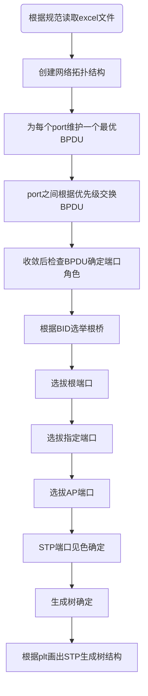
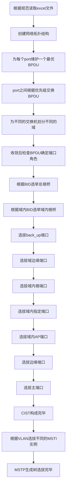
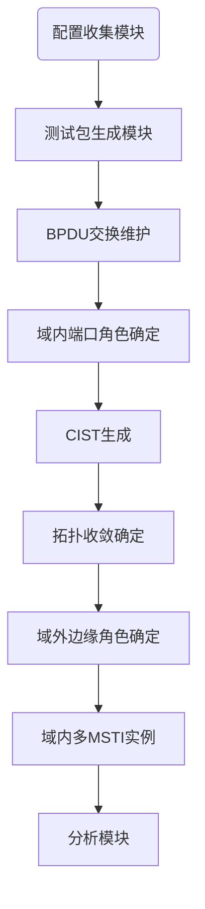

# 网络的二层协议仿真工具设计与实现

---

[toc]

## 一. STP仿真工具

### 1.1 STP算法简介

​		STP是一种用于解决二层环路交换网络环路的协议，在二层以太帧不存在防止环路的机制，一旦存在环路就会造成报文在环路内不断循环和增生，产生广播风暴，从而占用大量的带宽和资源，使网络变得不可用，在这种背景下生成树协议应运而生。生成树协议是一种二层管理协议，它通过有选择性地阻塞网络冗余链路来达到消除二层环路地目的，同时具备链路备份功能。生成树协议和其他协议一样，随着网络地发展而不断更新迭代。最初被广泛运用应用地是IEEE 802.1d-1998 STP，随后以它为基础产生了IEEE 802.1w RSTP（快速生成树协议）和IEEE 802.1s MSTP（多生成树协议）。

​		项目中，我们围绕 `Networkx`进行交换机端口角色的选拔，从而确立生成树。

​		首先我们为每个路由器端口维护BPDU，端口之间不断进行BPDU的交换，同时根据BPDU优先级规则进行BPDU的信息更迭，稳定后选拔端口见色，所有端口见色选拔结束后，STP网络拓扑图形成

​		**根桥选举**：根桥是STP树的根节点，相当于一棵树的树根。要想生成一棵STP树，首先需要选举出树根。根桥是整个交换网络的中心，网络中只能存在一个根桥。通常核心交换机是STP的根交换机。运行STP的交换机初始启动后都会认为自己是根桥，并在发送的BPDU报文中标识自己为根桥。当交换机从网络中收到其他交换机发送的BPDU报文后，会将BPDU报文中的网桥ID和自己的网桥ID进行对比，交换机不断地交互BPDU报文并对比网桥ID，最终会选举出一台网桥ID最小的交换机为根桥。网桥ID的比较原则是，先比较网桥ID优先级，越小越优先，默认优先级为32728；如果优先级一样，则比较系统MAC地址（而非接口MAC地址），MAC地址越小越优先。

​		**根端口选举**：根桥完成选举后，除被选为根桥的交换机以外其他的交换机都成为非根桥，而每一台非根桥的交换机都需要选举出一个到达根桥的根端口，其中比较优先级如下：

1. 比较BPDU报文中的根桥ID（RID），优选RID小的（在一个网络中只能存在一个根桥，所以RID都是一致的）。
2. 如果RID一致，比较到达根桥的累计路径开销（RPC），优选RPC小的。

2. 如果到达根桥的RPC一致，比较BPDU报文发送者（即上游交换机）的网桥ID，优选BID小的。

3. 如果发送者的BID一致，比较BPDU报文发送者的端口ID，优选端口ID小的。

4. 如果发送者的端口ID一致，比较BPDU报文接收者的本地端口ID，优选本地端口ID小的。

​		**指定端口选举**：根端口保证了非根桥到根桥路径的唯一性和最优性，为了防止环路在每条链路上还需要选举一个指定端口。首先比较报文到达根桥的累计路径开销（RPC），累计根路径开销最小的端口就是指定端口；如果RPC相同，则比较端口所在交换机自身的网桥ID（BID）,网桥ID最小的端口被选举为指定端口。如果通过RPC和BID选举不出指定端口，则比较接收者本地端口ID,本地端口ID最小的被选举为指定端口。

​		**AP端口选举**：剩余端口为AP端口，阻塞

STP生成树生成完毕

### 1.2 端口角色选拔流程图：

### 1.3 代码介绍

#### 1.3.1网络拓扑输入范例简介

​			代码读取Excel建立网络拓扑图，其中有三个子表分别为：`switch` ` port` `edge`三个子表，其中输入规范如下：目前已经准备了多种的测试样例以供测试

`switch`

对于`switch`子表：

1. PORT：对应switch端口号
2. BID：对应switch 的BID
3. name：对应switch名字

`PORT`子表：

对于PORT子表：

1. PID：代表port ID
2. RPC：代表 跟路径开销
3. SBID：发送者BID
4. SPID：发送者PID
5. BID：端口对应switch的BID
6. Port_status: 端口对应状态

`EDGE`子表：

1. Port1：对应edge的一个顶点
2. Port2：对应edge的另外一个订单
3. weight：线路的cost

#### 1.3.2 代码简介

整个算法STP包内包含4个具体的模块分别为 `__init__.py` `function.py` `myClass.py` `stp.py`

`__init__.py`: 为运行程序具体环境及其他 `function.py` `myClass.py` 函数，类导入

`function.py` ：自定义函数，主要为`dijisitela`算法的实现，对最短路径的确定及路径长度的计算，以及对选定switch寻找算法

`myClass.py`:自定义类，定义switch类及输入类

`stp.py`:为打包过的源文件（可以直接运行的.py	源文件）

包对应主函数为`stp_test.py`（主函数主体部分）

******* **主函数对应不同部分均有注释解释，严谨通过上方端口角色选拔过程进行角色选拔，完成生成树选拔******

### 1.4 运行方法：

函数已经提供自定义图像输入，通过常见遵守样例的输入的` .xlsx`文件进行读取网络拓扑结构

1. 运行方法：修改`20h`如下图所示的`./slsx`文件(目前已经提供了`switch1.xlsx`, `switch.xlsx`测试)

2. 修改如下的`267h`对应的switch节点图像路径

3. 运行直接运行，自动跑出图像

测试结果：

红线为创送状态，蓝线为阻塞状态

## 二. MSTP仿真工具

### 2.1 MSTP算法简介

​		MSTP不仅涉及多个MSTI（生成树实例），而且还可划分多个MST域（MST Region，也称为MST区域）。总的来说，一个MSTP网络可以包含一个或多个MST域，而每个MST域中又可包含一个或多个MSTI。组成每个MSTI的是其中运行STP/RSTP/MSTP的交换设备，是这些交换设备经MSTP协议计算后形成的树状网络。

同样为了生成这样的树，我们需要在每个不同的域内来选拔不同的角色：

除开STP生成的端口角色外，新增加了边缘端口，域边缘端口，主端口，backup端口，根据BPDU优先级规则来选举端口角色

### 2.2 端口角色选拔流程图

### 2.3 代码介绍

#### 2.3.1网络拓扑输入范例简介

​			代码读取Excel建立网络拓扑图，其中有三个子表分别为：`switch` ` port` `edge`三个子表，其中输入规范如下：目前已经准备了多种的测试样例以供测试

`switch`

对于`switch`子表：

1. PORT：对应switch端口号
2. priority：对应switch 的优先级，用于生成BID
3. name：对应switch名字
4. mac：对应switch 的mac地址，用于生成BID
5. region_name: 表示switch属于哪一个域

`PORT`子表：

对于PORT子表：

1. PortID：代表port的名字
2. Port: switch内端口号
3. priority：优先级
4. PID：PID
5. Root_Bridge_ID:总根桥BID
6. EPRC：外部路径开销
7. Region_bridge_ID: 域内根桥ID
8. IRPC：代表内部路径开销
9. Designated_PID：上游PORT PID
10. Designated_BID：上游交换机BID
11. received_PID：端口PID
12. Port_status: 端口对应状态
13. switch_bid: 端口对应的switch的bid

`EDGE`子表：

1. Port1：对应edge的一个顶点
2. Port2：对应edge的另外一个订单
3. cost：线路的cost
4. VLAN: edge可通过的VLAN
5. 所属域名

#### 2.3.2 代码简介

整个算法MSTP包内包含4个具体的模块分别为 `__init__.py` `function.py` `myClass.py` `mstp.py`

`__init__.py`: 为运行程序具体环境及其他 `function.py` `myClass.py` 函数，类导入

`function.py` ：自定义函数：`dijisitela`算法的实现，对最短路径的确定及路径长度的计算，以及对选定switch寻找算法，备份端口中哈希重复算法，bid，name寻找算法等，可见注释

`myClass.py`:自定义类，定义switch类及输入类

`mstp.py`:为打包过的源文件（可以直接运行的.py	源文件）

包对应主函数为`mstp_test.py`（主函数主体部分）

部分代码：

******* **主函数对应不同部分均有注释解释，严谨通过上方端口角色选拔过程进行角色选拔，完成生成树选拔******

### 2.4 运行方法：

函数已经提供自定义图像输入，通过常见遵守样例的输入的` .xlsx`文件进行读取网络拓扑结构

1. 运行方法：修改`10h`如下图所示的`./slsx`文件

3. 直接运行，完成到目前的结果

   

测试结果：

域内IST生成完毕，端口角色选拔完毕

## 三. 后期任务：

1. 继续完成MSTP算法，选拔VLAN内的MSTI树

2. 完成GUI包装，使得成为一个协议仿真工具

## 

